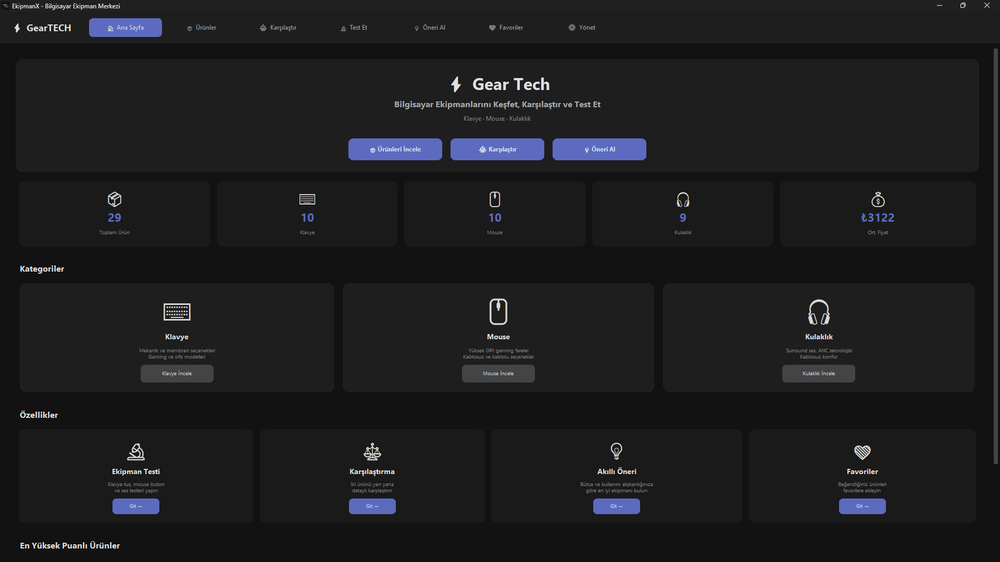
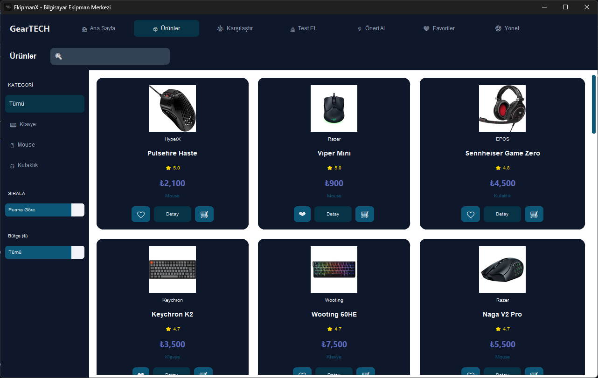
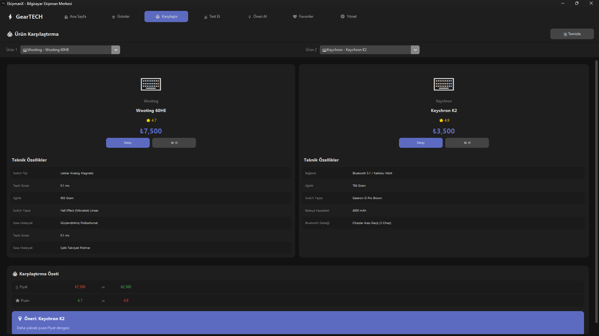
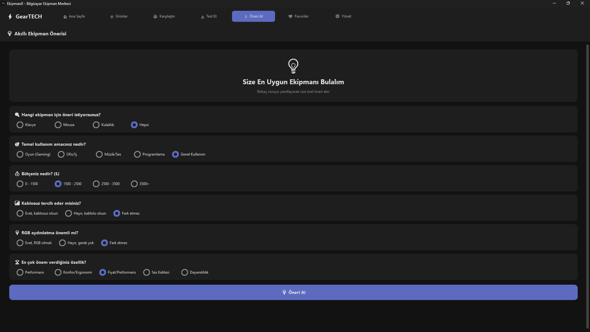
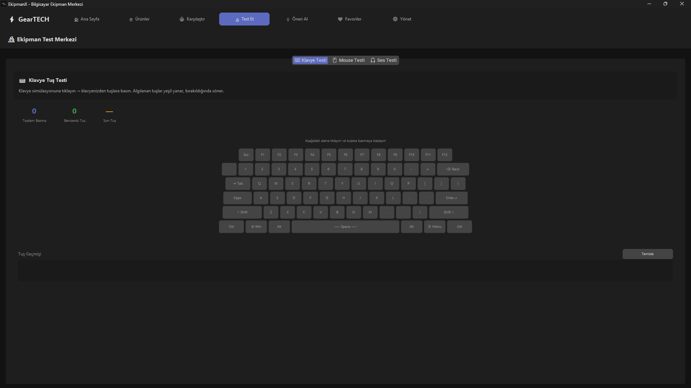
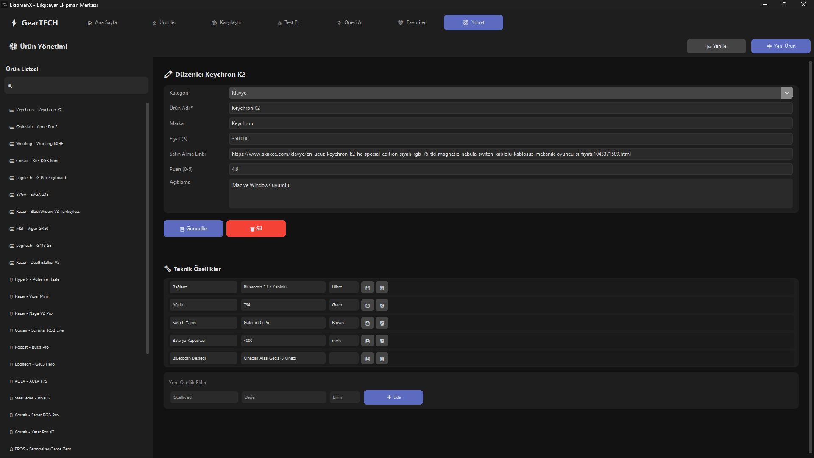
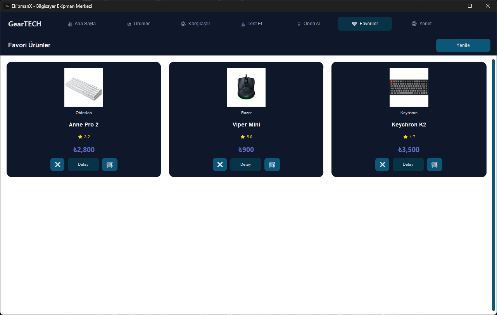

# ⚡ GearTech - Bilgisayar Ekipman Merkezi

GearTech, bilgisayar donanım ve çevre birimlerini (Klavye, Mouse, Kulaklık) detaylıca incelemek, teknik özelliklerini kıyaslamak, kişiselleştirilmiş akıllı öneriler almak ve donanım testleri gerçekleştirmek için geliştirilmiş modern bir Windows masaüstü uygulamasıdır.

---

## 📸 Ekran Görüntüleri 

### 🖥️ Ana Sayfa & Ürün Listesi
<table>
  <tr>
    <td width="50%"><b>Ana Sayfa (Dashboard)</b></td>
    <td width="50%"><b>Ürün Listesi & Filtreleme</b></td>
  </tr>
  <tr>
    <td></td>
    <td></td>
  </tr>
</table>

### 🔄 Karşılaştırma & 💡 Akıllı Öneri
<table>
  <tr>
    <td width="50%"><b>Ürün Karşılaştırma Modülü</b></td>
    <td width="50%"><b>Akıllı Ekipman Önerisi (Anket)</b></td>
  </tr>
  <tr>
    <td></td>
    <td></td>
  </tr>
</table>

### ⌨️ Ekipman Testi & ⚙️ Ürün Yönetimi (CRUD)
<table>
  <tr>
    <td width="50%"><b>Klavye Tuş Test Merkezi</b></td>
    <td width="50%"><b>Ürün Yönetim Paneli (Admin)</b></td>
  </tr>
  <tr>
    <td></td>
    <td></td>
  </tr>
</table>

### ❤️ Favori Ürünler
<p align="center">
  
</p>

---

## 🌟 Öne Çıkan Özellikler

* **Dinamik Dashboard:** Toplam ürün sayısı, kategori bazlı dağılımlar ve sistemdeki ortalama fiyat gibi istatistikleri anlık olarak gösteren modern arayüz.
* **Gelişmiş Filtreleme ve Arama:** Ürünleri kategorilerine (Klavye, Mouse, Kulaklık) göre ayırma, puana göre sıralama ve bütçe aralığına göre anlık filtreleme.
* **Detaylı Karşılaştırma Sistemi:** İki farklı ekipmanı yan yana getirerek teknik özelliklerini, fiyatlarını ve puanlarını kıyaslar; kullanıcıya otomatik olarak f/p dengesi önerisi sunar.
* **Akıllı Öneri Algoritması:** Kullanıcının kullanım amacına (Oyun, Ofis, Programlama vb.), bütçesine, bağlantı türüne (Kablolu/Kablosuz) ve öncelik verdiği kritere göre en uygun cihazı nokta atışı tespit eder.
* **Donanım Test Merkezi:** Entegre interaktif klavye simülasyonu ile tuşların basım durumunu, toplam basım sayısını, benzersiz tuş geçmişini anlık olarak test etme imkanı.
* **Favorilere Ekleme:** Beğenilen ürünleri hızlı erişim için favori listesine kaydetme ve yönetme.
* **Gelişmiş Ürün Yönetimi (CRUD):** Yönetici paneli üzerinden dinamik teknik özellik (Key-Value) ekleme, silme, ürün bilgilerini güncelleme ve yeni ekipman tanımlama.

---

## 🛠️ Kullanılan Teknolojiler

* **Arayüz (UI/UX):** Python & CustomTkinter (Modern, karanlık tema destekli bileşenler)
* **Veritabanı:** MySQL (İlişkisel veritabanı mimarisi, dinamik teknik özellik tabloları)
* **Görsel & İkonlar:** Pillow (PIL) kütüphanesi ile optimize edilmiş donanım ikonları

---

## 🚀 Kurulum ve Çalıştırma

### Gereksinimler
* Python 3.x
* MySQL Server

### 1. Depoyu Klonlayın
```bash
git clone [https://github.com/makifblc/equipment_app.git](https://github.com/makifblc/equipment_app.git)
cd equipment_app
